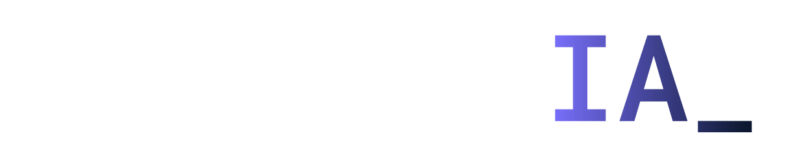

# PetLens

**PetLens é uma ferramenta experimental que explora o uso da Inteligência Artificial Generativa do Google para fornecer soluções inovadoras para donos de pets.** 🐾

 

  
   

  <em>Imagem gerada por inteligência artificial, representando a integração de tecnologia no cuidado pet.</em>

 

## O PetLens busca oferecer soluções para os seguintes desafios:

* **Diagnóstico Auxiliado por IA:** A preocupação com os primeiros sinais de doença é frequente. O PetLens propõe um sistema onde os tutores podem descrever os sintomas iniciais de seus pets (como tosse, falta de apetite, manchas na pele) e receber possíveis diagnósticos diferenciais gerados pelo Gemini. É crucial ressaltar que esta funcionalidade tem como objetivo fornecer uma primeira orientação e **não substituir a consulta com um veterinário**, mas sim ajudar o dono a entender a urgência da situação.

* **Personalização de Cuidados Preventivos:** Cada pet possui necessidades únicas. O PetLens visa criar um sistema que, baseado em informações específicas como raça, idade, histórico médico e até mesmo localização geográfica (considerando riscos de doenças regionais), possa gerar um plano de cuidados preventivos personalizado, incluindo sugestões de vacinação, vermifugação e exames específicos.

* **Enriquecimento Ambiental Personalizado:** Promover o bem-estar mental e físico dos pets é essencial. O PetLens ambiciona utilizar dados como raça, idade, nível de energia e histórico de comportamento para sugerir ideias criativas de enriquecimento ambiental, como brinquedos, atividades interativas e adaptações no ambiente doméstico.

* **Localização Inteligente de Serviços Pet-Friendly:** Encontrar serviços adequados para as necessidades específicas de um pet pode ser desafiador. O PetLens propõe um sistema que compreenda as necessidades detalhadas do usuário (por exemplo, "veterinário com atendimento de emergência para gatos perto de mim" ou "parque que permite cachorros grandes com área de agility") e forneça resultados relevantes com informações adicionais como horários de funcionamento e avaliações de outros usuários.

##

### Iniciativa do projeto

O projeto foi criado como entrega do desafio proposto durante a imersão de IA com o Google Gemini promovida pela Alura e pelo Google.

  

### Ferramentas ultilizadas 

* Google AI Studio
* Google Gemini
* Google Colab

